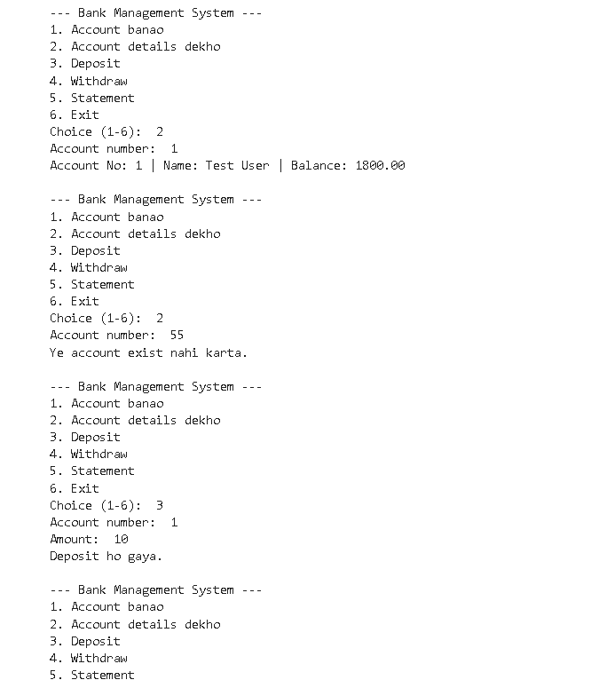
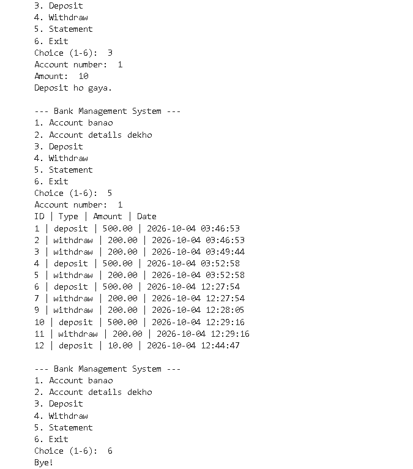

# Bank Management System

Command-line banking app in Python and MySQL: create accounts, deposit, withdraw and view transaction statements using SQL transactions (commit/rollback).

## Demo

**Account details, a non-existing account, and a deposit**

**Full transaction statement**

## Features
- Create a bank account with an opening balance
- View account details (account number, name, balance)
- Deposit and withdraw money
- View the transaction statement of an account
- Input validation and error handling (invalid amounts, accounts that do not exist, insufficient balance)

## Tech Stack
Python, MySQL, mysql-connector-python, Jupyter Notebook

## How it works
- Deposit and withdraw update the balance and insert a record in the `transactions` table in one SQL transaction. `commit()` saves both together; if anything fails, `rollback()` undoes both.
- `SELECT ... FOR UPDATE` locks the account row while it is being changed.
- Queries use `%s` placeholders instead of string formatting, which prevents SQL injection.
- Money is handled with `Decimal` instead of `float` to avoid rounding errors.
- The MySQL password is asked at runtime with `getpass` and is not stored in the code.

## Database
Two tables: `accounts` (account_no, name, balance) and `transactions` (id, account_no, type, amount, created_at). The full schema is in `schema.sql`.

## How to run
1. Install MySQL, Python 3 and Jupyter Notebook.
2. Run `schema.sql` in MySQL Workbench to create the database and tables.
3. Install the dependency: `pip install mysql-connector-python`
4. Open `bank-management-system.ipynb`, run the
